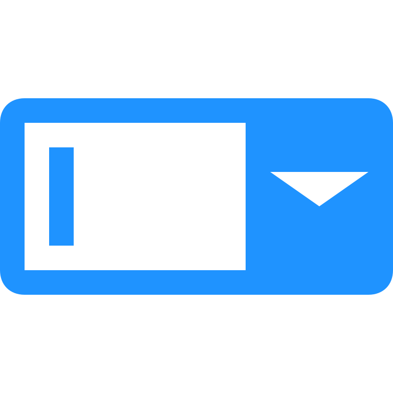

<h1 align="center" style="margin-top: 0px;">Select element CWC made for WinCC Unified</h1>

<p align="center" style="margin-bottom: 0px !important;">
  
</p>


### **1. CONTENT**

HTML sleect element

### **2. INTERFACE**

  - **rows** : Array of element to show in the drop-down list 

  ```js 
      // Example
      rows: [["element1"], ["element2"], ["element3"], ["element4"]]
  ```

  - **current** : Name of the element to be shown as default (leave empty to disable)

  ```js 
      // Example
      current: "element1"
  ```

### **3. EVENTS**

   - **ev_selectElement** : This event is triggerd every time an user interact with the dop down element, as a result in the "rowId" object
  ```json
      // Example
      rowId : "element2"
  ```

### **4. USAGE**

  - OFFLINE MODE
    - You can test the behavior of the chart with custom data by setting "production" to false
    - Now you can change all the data from "WebCC.Properties"

    ```js
    var production = false;
    //...
    WebCC.Properties = {
      current: "element1",
      rows: [
              ["element1"],
              ["element2"],
              ["element3"],
              ["element4"]
            ]
      };
    ```

  - ONLINE MODE (WinCC Unfied)
    -  Set "production" to true
    ```js
    var production = true;
    ```
    - To import the custom web control the hierarchy of folders and files must be compressed in ZIP format.
    - The name of the ZIP must be the GUID used the "manifest.json" file surrounded by curly brackets

    ```json
      type": "guid://1B4B9F13-ADBF-49FD-B759-F04DF3647C93",
    ```
    - {1B4B9F13-ADBF-49FD-B759-F04DF3647C93}.zip
    - If you want this custom web control available for all your project, copy this file in the folder : 
      - C:\Program Files\Siemens\Automation\Portal V17\Data\Hmi\CustomControls
      - replace "Portal V17" with your Tia version.
    - If you want to use this custom web control only in one project copy this file in the folder :

      - \path_to_tia_project\UserFiles


    - Refresh "My controls" to update the files in TIA Portal
    - Now you can place the custom web control in the Screen.


